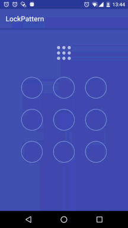

# LockPattern

项目介绍：图像解锁控件，借鉴了一个开源的项目并增加修改了个性化的需求。

截图如下：  

   

##使用方式
1.layout.xml引用控件
#### 代码块
```xml
    <com.carsmart.lockpattern.LockPatternView
        android:layout_width="wrap_content"
        android:layout_height="wrap_content"
        app:item_padding="15dp"
        app:line_select="@color/line_normal"
        app:line_warn="@color/line_warn"
        app:line_width="2dp"
        app:normal="@mipmap/large_normal"
        app:select="@mipmap/large_select"
        app:warn="@mipmap/large_warn" />
```

2.Java调用：根据逻辑功能实现如下接口
```java 

    //校验
    public interface OnVerifyListener {

        boolean isVerify(List<String> records);

        void onSuccess();

        void onFailed();
        
    }

    //设置
    public interface OnSettingListener {

        void onSetting(List<String> records);
        
    }
```

##问题反馈
如有任何问题，欢迎反馈给我，可以用以下联系方式跟我交流

* 邮件(267023750#qq.com, 把#换成@)
* QQ: 267023750